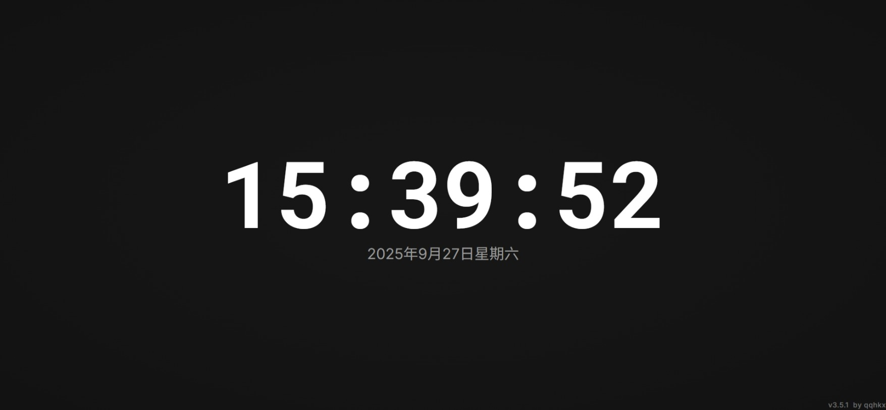
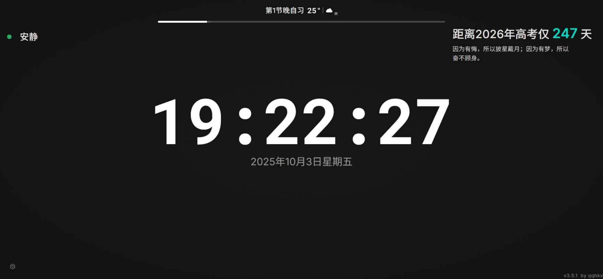
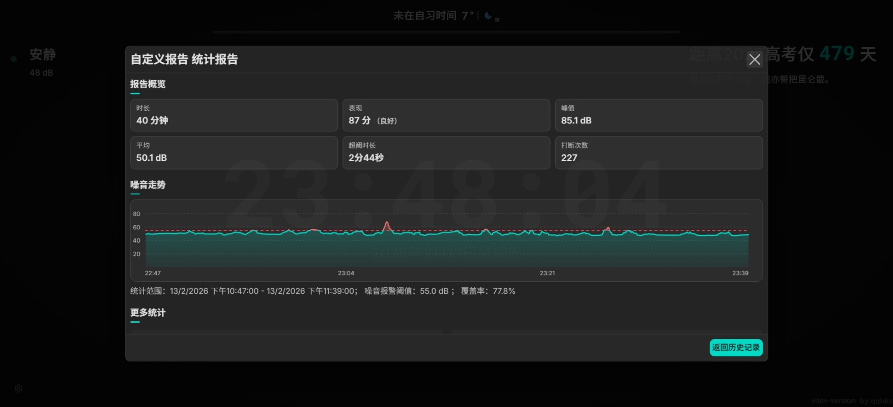
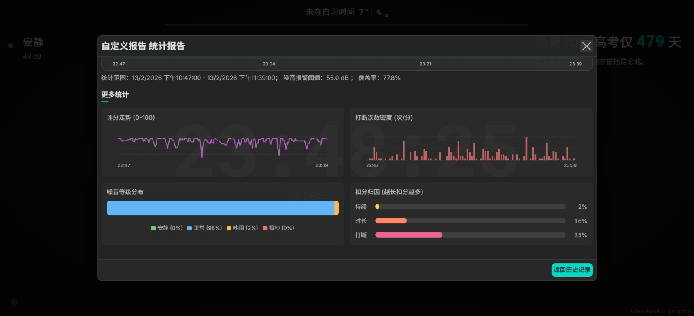
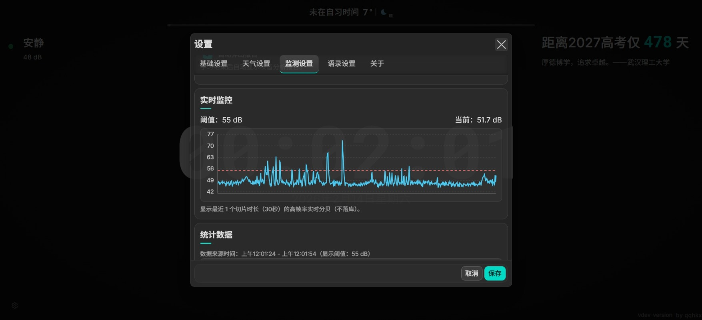
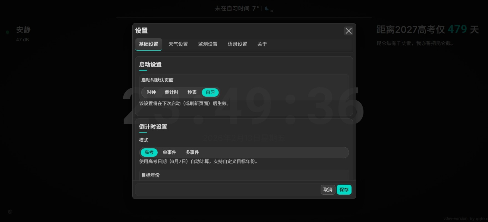
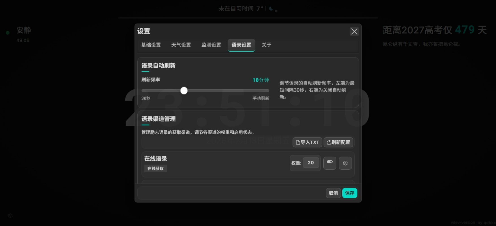
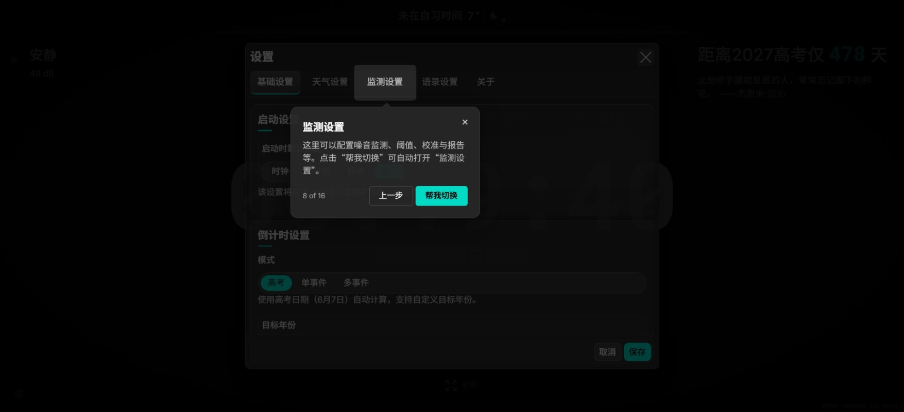
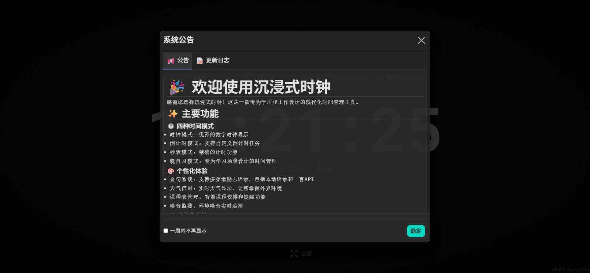
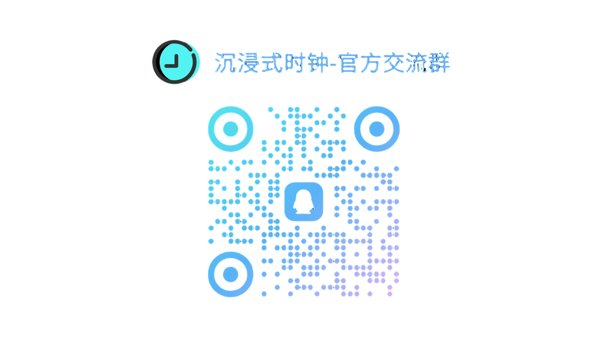

<div align="center">
  
  <h1>Immersive Clock | 沉浸式时钟 ⏰</h1>
  <p>English ｜ <a href="./README.md">简体中文</a></p>

[🖥️ Live Demo](https://clock.qqhkx.com)

[](LICENSE)
[](https://reactjs.org/)
[](https://www.typescriptlang.org/)
[](https://vitejs.dev/)
[](https://www.electronjs.org/)
[](https://github.com/QQHKX/immersive-clock/releases)
[](https://web.dev/progressive-web-apps/)

**Elegant time management, focused studying**

</div>

> **⏸️ Maintenance Notice**
>
> Because the author is in the final year of high school, the project is paused for non-essential development and maintenance. Pull requests and issues are welcome, but processing and merging may be slow.


---

## Table of Contents

- [Overview](#overview)
- [Gallery](#gallery)
- [Quick Start Guide](#quick-start-guide)
- [Features](#features)
- [Usage](#usage)
- [Accessibility](#accessibility)
- [Project Structure](#project-structure)
- [FAQ](#faq)
- [Feedback & Discussion](#feedback--discussion)
- [Contributing & Development](#contributing--development)
- [License & Author](#license--author)
- [Star History](#star-history)

---

## Overview

**Immersive Clock** is a lightweight desktop/web clock app built with **React + TypeScript + Vite**.  
It supports Clock, Countdown, Stopwatch, and Study Mode with built-in weather monitoring, noise analysis, multi-channel motivational quotes, and multi-target countdown carousel features.  
With PWA technology, it supports offline use, automatic updates, and desktop installation experience.

> Use cases: campus self-study, focused learning, Pomodoro timer, presentation dashboard, desktop clock.

## Gallery

<div align="center">
  
  
</div>

<div align="center">
  
</div>

<div align="center">
  
</div>

<div align="center">
  
  
  
</div>

<div align="center">
  
  
</div>

## Features

### ⏰ Time Management Modes

- **Mode Switching**: Clock / Countdown / Stopwatch / Study Mode with one-click switching
- **Smart HUD**: Immersive interaction; show on click or keypress, auto-hide after ~8 seconds of inactivity
- **Advanced Countdown**:
  - Single and goal-based countdown (e.g., college entrance exam, postgraduate entrance exam)
  - **Multi-event Carousel**: Add multiple important dates and auto-rotate display at set intervals
  - **Customization**: Independent configuration for each countdown item's background color, opacity, and font style

### 📚 Study Dashboard

- **Environment Awareness**:
  - **Real-time Weather**: Integration with QWeather API for minute-level precipitation alerts and weather alerts
  - **Noise Monitoring**: High frame-rate real-time sampling based on Web Audio API, built-in scoring engine, baseline calibration, maximum threshold settings, and detailed study report with trend charts
- **Focus Atmosphere**:
  - **Motivational Quotes**: Multi-channel sources support, configurable channel weights and auto-refresh frequency
  - **Component Toggles**: Freely hide noise, quotes, large time display, etc., to customize your study interface
  - **Background Customization**: Support solid colors, radial gradients, and upload local images as background
  - **Custom Fonts**: Support uploading custom font files (.ttf/.woff2) for comfortable reading experience
  - **Schedule Import**: Support Excel schedule file import for one-click sync of study plans

### 🚀 Performance & Experience

- **PWA Support**: Offline caching, desktop installation, automatic updates
- **User-Friendly**: Friendly first-time-use guidance to help users quickly master core features
- **Resource Optimization**: Tiered caching strategy for static resources (images/fonts/audio), fast loading
- **Accessibility**: Full keyboard navigation support (Space/Enter to show HUD), optimized ARIA attributes

---

## Quick Start Guide

We offer multiple usage options for different scenarios.

### 📱 Option 1: PWA Installation (Highly Recommended)

With PWA technology, you can install this clock like a native app, with **offline use**, **desktop icon launch**, and **automatic updates**, without downloading a large installation package.

**Installation Steps:**

1. Open the demo site with Chrome, Edge, or other modern browsers
2. Click the **"Install Immersive Clock"** icon on the right side of the address bar (usually a small monitor icon with a plus sign)
3. After confirmation, the app will run in a standalone window and automatically create an icon on your desktop/start menu

### 🌐 Option 2: Browser Direct Usage

If you don't want to install anything, you can use the web version directly.

> It's recommended to use the latest versions of **Chrome**, **Edge**, or **Safari** for the best performance and animation experience.

### 💻 Option 3: Electron Desktop Version

If you need a more traditional desktop software experience (Windows/macOS/Linux), you can download the Electron packaged version.

- **Download**: [GitHub Releases](https://github.com/QQHKX/immersive-clock/releases/latest)
- **Installation**:
  - **Windows**: Download and run the `.exe` installer
  - **macOS**: Download the `.dmg` file and drag the app to Applications folder
  - **Linux**: `.AppImage` or `.deb` packages available

---

## Usage

- **Mode Switch**: Click page or press `Space/Enter` to show HUD
- **Countdown**: Double-click time to configure; supports presets and chimes
- **Stopwatch**: Start, pause, accumulate records
- **Study Mode**:
  - **Multi-target Carousel**: Add multiple countdown events in settings to auto-rotate display
  - **Environment Monitoring**: Enable noise monitoring to automatically record and alert on threshold; rain/snow weather triggers warning popops
- **Settings Panel**: Adjust target year, noise baseline, quote refresh interval, custom background, etc.

For detailed instructions:

- [Usage Guide (English)](docs/usage.en-US.md)
- [🎙️ Scoring System Guide](public/docs/noise-scoring.md)

---

## Accessibility

| Shortcut          | Action                     |
| ----------------- | -------------------------- |
| `Space / Enter`   | Show HUD                   |
| `Enter / Esc`     | Confirm or close modal     |
| Double click time | Open countdown settings    |
| Double tap        | Mobile interaction support |

---

## Project Structure

```text
immersive-clock/
├── electron/          # Electron main process and preload scripts
├── public/            # Static assets (icons, audio, PWA manifest, docs)
├── src/               # Source code
│  ├── components/     # UI component library (Clock, HUD, NoiseMonitor, etc.)
│  ├── contexts/       # Global state management (Reducer/Context)
│  ├── hooks/          # Custom hooks (high-precision timer, audio, etc.)
│  ├── services/       # Business services
│  │  ├── noise/       # Noise analysis and scoring engine (core)
│  │  └── ...          # Weather, location services
│  ├── utils/          # Utilities and local storage (includes Excel import, font management)
│  ├── styles/         # Global styles and variables
│  └── pages/          # Page containers
├── tests/             # E2E test cases (Playwright)
├── docs/              # Usage instructions and FAQ
├── scripts/           # Post-build scripts
├── vite.config.ts     # Vite config (PWA and version injection)
└── package.json       # Project metadata and scripts
```

---

## FAQ

- Can't locate city? Check browser location permissions or use manual refresh.
- No noise monitoring data? Ensure microphone is granted and your device supports it.
- HUD not showing? Make sure no modal is open; click page or press `Space/Enter`.
- How to view announcements and changelog? Click the version number at bottom-right or open the modal from menu.

More Q&A in [docs/faq.en-US.md](docs/faq.en-US.md).

---

## Feedback & Discussion

Welcome to join our official communication group to share experiences, report bugs, or suggest features.



<p align="center"><a href="https://qm.qq.com/q/fawykipRhm">QQ Group | 965931796</a></p>

You can also provide feedback through the following channels (it's recommended to include reproduction steps, screenshots, or screen recordings for quick resolution):

- GitHub Issues: [https://github.com/QQHKX/immersive-clock/issues](https://github.com/QQHKX/immersive-clock/issues)
- In-app Feedback: Click the "version number" at bottom-right to open the announcement modal → switch to "Feedback"
- Direct Survey Link: [https://wj.qq.com/s2/25666249/lj9p/](https://wj.qq.com/s2/25666249/lj9p/)

## Contributing & Development

If you want to contribute code, fix issues, or do secondary development locally, please read the [Contribution Guide](CONTRIBUTING.en-US.md).

---

## License & Author

- License: GPL v3
- Author: **QQHKX**
  - 🌐 [Personal Website](https://qqhkx.com)
  - 💻 [GitHub](https://github.com/QQHKX)

## Derivative Projects

### Immersive Noise Monitoring (Immersive-clock-monitor)

- **Project Address**: [https://github.com/QQHKX/Immersive-clock-monitor](https://github.com/QQHKX/Immersive-clock-monitor)

This project extracts and independently maintains the noise monitoring module from **Immersive Clock**, aiming to publicly release a high-quality noise monitoring algorithm implementation reference based on psychoacoustics and focus theory.

The algorithm is not just a simple decibel meter, but quantifies the interference level of environmental noise on learning flow through a multi-dimensional weighted deduction system.

## Friendly Links

-  [SECTL](https://sectl.top/)

## ⭐️ Star History

<div align="center">
  <a href="https://www.star-history.com/#QQHKX/Immersive-clock&type=date&legend=top-left">
  <picture>
    <source media="(prefers-color-scheme: dark)" srcset="https://api.star-history.com/svg?repos=QQHKX/Immersive-clock&type=date&theme=dark&legend=top-left" />
    <source media="(prefers-color-scheme: light)" srcset="https://api.star-history.com/svg?repos=QQHKX/Immersive-clock&type=date&legend=top-left" />
    
  </picture>
  </a>
</div>
