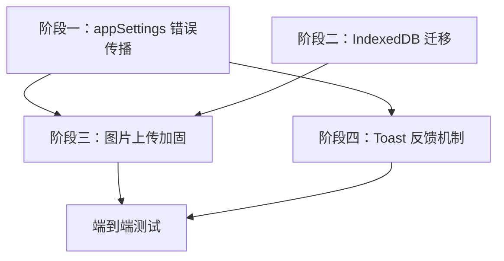

# 设置持久化 & 背景图片 & 错误反馈 修复规划书

## 问题概述

当前项目存在三类互相关联的问题：

1. **设置持久化 Bug**：倒计时字体（`numericFontFamily` / `textFontFamily`）、数字颜色（`digitColor`）等 `study.style` 字段保存后刷新页面被重置
2. **背景图片格式兼容性 Bug**：上传 `.jfif`、`.webp` 等格式的背景图片后，刷新页面背景丢失
3. **错误反馈机制缺失**：设置保存失败时无任何用户可见的错误提示

---

## 部署环境约束（Vercel Hobby 免费版）

> [!IMPORTANT]
> 项目部署在 **Vercel Hobby（免费版）** 上，这是一个纯静态托管环境，对本次修复方案有以下直接约束：

| 约束项 | 影响 |
|-------|------|
| **无后端服务** | 所有用户数据（设置、图片、字体）只能存储在客户端（localStorage / IndexedDB），没有服务器端备份或同步机制 |
| **无 API Routes / Serverless Functions** | 不可能实现服务器端图片压缩或格式转换，所有图片处理必须在浏览器端通过 Canvas API 完成 |
| **无服务器端存储** | 无法使用 Vercel Blob / KV / Postgres 等付费存储服务，用户数据一旦客户端丢失则不可恢复 |
| **CDN 边缘缓存** | 静态资源通过 Vercel CDN 分发，PWA Service Worker 缓存策略需与 CDN 缓存协调 |
| **构建产物为纯静态 SPA** | `vite build` 生成的 `dist/` 目录直接部署，运行时完全依赖浏览器环境 |

**对修复方案的影响：**

- **客户端存储是唯一选择** → IndexedDB 迁移方案（阶段二）的健壮性至关重要，必须包含完善的失败降级机制
- **图片只能客户端压缩** → Canvas 压缩质量需更激进（建议 0.6-0.7），确保 base64/Blob 体积可控
- **数据不可恢复** → 错误反馈（阶段四）必须在数据丢失**前**及时提醒用户，而非事后通知
- **无需考虑服务端限制** → 不涉及 Vercel Hobby 的 Serverless 函数执行时间（10s）、带宽（100GB/月）等限制

---

## 根因分析

### 问题 1：设置被意外重置

> [!IMPORTANT]
> 根因在于 **localStorage 写入失败时静默吞错** + **设置面板保存逻辑可能存在竞态或覆盖问题**。

**分析路径：**

- `appSettings.ts` 中 `updateAppSettings()` 的深合并逻辑（第 356-465 行）本身对 `study.style` 的合并是正确的：
  ```typescript
  style: studyUpdates.style
    ? { ...current.study.style, ...studyUpdates.style }
    : current.study.style,
  ```
- 但 `localStorage.setItem()` 调用（第 461 行）在 `try/catch` 中只记录了日志，**未向调用方返回成功/失败状态**：
  ```typescript
  try {
    localStorage.setItem(APP_SETTINGS_KEY, JSON.stringify(nextSettings));
  } catch (error) {
    logger.error("Failed to save AppSettings", error); // ← 静默失败
  }
  ```
- **关键场景**：当背景图片的 base64 数据 URL 存入 `study.background.imageDataUrl` 后，整个 AppSettings JSON 可能接近或超过 localStorage 配额（通常 5-10MB）。此时**后续的任何 `updateAppSettings()` 调用都会失败**（包括字体、颜色等设置的保存），但用户看不到任何错误。由于 Vercel Hobby 无后端存储，这意味着用户**将永久丢失这些设置修改**。
- 此外需排查 `BasicSettingsPanel.tsx` 的保存逻辑是否存在：
  - 保存时未包含所有已修改的 `style` 字段（遗漏字段）
  - 多个设置面板同时保存导致的覆盖（竞态条件）
  - 本地 state 初始化时未正确从 `getAppSettings()` 读取已存储的值

### 问题 2：背景图片格式兼容性

> [!IMPORTANT]
> 根因在于 **Canvas `toDataURL` 对特殊格式的兼容性** + **base64 存入 localStorage 的容量限制**。

**分析路径：**

- `BasicSettingsPanel.tsx`（约第 1192-1215 行）的图片上传流程：
  ```
  FileReader.readAsDataURL(file) → Image.onload → Canvas.drawImage → canvas.toDataURL("image/jpeg", 0.75)
  ```
- **JFIF 格式问题**：`.jfif` 是 JPEG 的变体，部分浏览器的 `` 标签可以显示，但 `Image()` 构造函数加载后 `drawImage` 到 Canvas 可能出现解码异常（尤其是包含 EXIF 数据或非标准 JFIF 头的文件）。若 `Image.onload` 不触发而 `onerror` 未设置处理，则**整个操作静默失败**。
- **WebP 格式问题**：较旧浏览器（如 Safari < 16）不支持 WebP 的 Canvas 绘制。即使支持，`toDataURL("image/jpeg")` 转码时若源图尺寸过大，生成的 base64 字符串可能非常长。
- **localStorage 配额溢出**：一张 2MB 的图片经 base64 编码后约 2.67MB，加上原有 AppSettings 数据，很容易触发 `QuotaExceededError`。但当前代码**未捕获这个写入错误**。
- **无格式白名单**：`<input type="file" accept="image/*">` 允许所有图片格式，但后续处理链只对 JPEG/PNG 经过充分测试。

### 问题 3：错误反馈缺失

> [!WARNING]
> 当前项目在设置保存操作上完全没有用户可见的错误反馈机制。

**现有错误反馈方式（仅限其他场景）：**

| 组件/模块 | 反馈方式 | 覆盖场景 |
|-----------|---------|---------|
| `BasicSettingsPanel.tsx` | `alert()` | 字体导入失败、系统字体读取失败 |
| `StudySettingsPanel.tsx` | `openMessagePopup()` | 噪音校准失败 |
| `errorCenter.ts` | 错误中心（HUD 显示） | 运行时错误聚合 |
| `MessagePopup` | 弹窗组件 | 通用消息展示 |

**缺失场景：**
- `updateAppSettings()` / `updateStudySettings()` 等写入失败
- 背景图片上传处理失败（解码/压缩/存储）
- 字体/颜色等样式设置保存失败
- localStorage 配额溢出

---

## 修复方案

### 阶段一：`appSettings` 写入层增加错误传播

> 让所有设置写入操作能够向上报告成功/失败状态。

#### [MODIFY] [appSettings.ts](file:///d:/WebstormProjects/Immersive-clock-main/src/utils/appSettings.ts)

**变更 1：`updateAppSettings` 增加返回值**

```diff
-export function updateAppSettings(
-  partial: DeepPartial<AppSettings> | ((current: AppSettings) => DeepPartial<AppSettings>)
-): void {
+export interface SettingsSaveResult {
+  success: boolean;
+  error?: string;
+  quotaExceeded?: boolean;
+}
+
+export function updateAppSettings(
+  partial: DeepPartial<AppSettings> | ((current: AppSettings) => DeepPartial<AppSettings>)
+): SettingsSaveResult {
   try {
     // ...existing merge logic...
     localStorage.setItem(APP_SETTINGS_KEY, JSON.stringify(nextSettings));
+    return { success: true };
   } catch (error) {
     logger.error("Failed to save AppSettings", error);
+    const isQuota = error instanceof DOMException && error.name === "QuotaExceededError";
+    return {
+      success: false,
+      error: isQuota ? "存储空间不足，请清理背景图片或其他大体积数据" : "设置保存失败",
+      quotaExceeded: isQuota,
+    };
   }
 }
```

**变更 2：所有 helper 函数同步返回 `SettingsSaveResult`**

```diff
-export function updateStudySettings(updates: DeepPartial<AppSettings["study"]>): void {
-  updateAppSettings({ study: updates });
-}
+export function updateStudySettings(updates: DeepPartial<AppSettings["study"]>): SettingsSaveResult {
+  return updateAppSettings({ study: updates });
+}
```

同理修改 `updateGeneralSettings`、`updatePerformanceSettings`、`updateTimeSyncSettings`、`updateNoiseSettings`。

---

### 阶段二：背景图片存储迁移到 IndexedDB

> 将大体积的图片数据从 localStorage 迁移到 IndexedDB，从根本上解决配额问题。

> [!NOTE]
> **为什么选择 IndexedDB 而非其他方案？**
> 由于 Vercel Hobby 无后端存储（无 Blob Storage / KV / Database），客户端存储是唯一选择。IndexedDB 的浏览器配额远大于 localStorage（通常为可用磁盘空间的 50% 或至少数百 MB），且原生支持 Blob 存储，无需 base64 编码膨胀。项目中 `studyFontStorage.ts` 已有成熟的 IndexedDB Blob 存储先例可复用。

#### 存储容量对比

| 存储方式 | 典型配额 | 适合场景 |
|---------|---------|----------|
| localStorage | 5-10 MB（整个源） | 轻量配置 JSON |
| IndexedDB | 可用磁盘 50%（数百 MB ~ 数 GB） | 大体积 Blob/文件 |
| Service Worker Cache | 可用磁盘 50%（与 IndexedDB 共享） | 静态资源缓存 |

#### [MODIFY] [studyBackgroundStorage.ts](file:///d:/WebstormProjects/Immersive-clock-main/src/utils/studyBackgroundStorage.ts)

新增以下能力：
- `saveBackgroundImage(blob: Blob): Promise<void>` — 将图片 Blob 存入 IndexedDB
- `loadBackgroundImage(): Promise<string | null>` — 从 IndexedDB 读取图片并返回 Object URL
- `clearBackgroundImage(): Promise<void>` — 清除 IndexedDB 中的背景图片
- `estimateStorageUsage(): Promise<{ used: number; quota: number } | null>` — 使用 `navigator.storage.estimate()` 估算当前存储用量（可选，用于在设置面板中展示存储状态）

#### [MODIFY] [db.ts](file:///d:/WebstormProjects/Immersive-clock-main/src/utils/db.ts)

- 在 IndexedDB schema 中新增 `backgrounds` object store（如尚不存在）
- 使用类似 `studyFontStorage.ts` 的 Blob 存储模式

#### [MODIFY] [appSettings.ts](file:///d:/WebstormProjects/Immersive-clock-main/src/utils/appSettings.ts)

- `study.background.imageDataUrl` 字段**保留但不再存储实际图片数据**
- 改为存储一个标志值（如 `"indexeddb"`），表示图片数据在 IndexedDB 中
- 或新增 `imageStorageType: "dataUrl" | "indexeddb"` 字段实现向后兼容

#### [MODIFY] [storageInitializer.ts](file:///d:/WebstormProjects/Immersive-clock-main/src/utils/storageInitializer.ts)

新增迁移逻辑：
1. 检查 AppSettings 中 `study.background.imageDataUrl` 是否包含实际 base64 数据
2. 若是，将其转换为 Blob 并存入 IndexedDB
3. 将 `imageDataUrl` 替换为标志值
4. 迁移成功后更新 AppSettings

> [!WARNING]
> **迁移失败降级策略**：由于无后端备份，迁移过程中如果 IndexedDB 写入失败，必须**保留原 localStorage 数据不做删除**，并通过 Toast 通知用户「背景图片存储优化失败，图片仍可使用但可能影响其他设置的保存」。下次启动时重试迁移。

---

### 阶段三：背景图片上传流程加固

> 增加格式验证、大小限制、兼容性处理和错误反馈。

#### [MODIFY] [BasicSettingsPanel.tsx](file:///d:/WebstormProjects/Immersive-clock-main/src/components/SettingsPanel/sections/BasicSettingsPanel.tsx)

**变更 1：图片格式白名单**

```typescript
const ALLOWED_IMAGE_TYPES = [
  "image/jpeg",
  "image/png",
  "image/webp",
  "image/gif",
  "image/bmp",
  "image/svg+xml",
];

// .jfif 文件的 MIME type 通常为 image/jpeg，需要额外检查扩展名
const ALLOWED_EXTENSIONS = [".jpg", ".jpeg", ".jfif", ".png", ".webp", ".gif", ".bmp", ".svg"];
```

**变更 2：文件验证**

```typescript
// 原始文件限制 5MB（Vercel Hobby 无服务端压缩，全部客户端处理，需控制内存占用）
const MAX_FILE_SIZE_MB = 5;

function validateImageFile(file: File): { valid: boolean; error?: string } {
  const ext = "." + file.name.split(".").pop()?.toLowerCase();
  if (!ALLOWED_EXTENSIONS.includes(ext) && !ALLOWED_IMAGE_TYPES.includes(file.type)) {
    return { valid: false, error: `不支持的图片格式: ${ext}` };
  }
  if (file.size > MAX_FILE_SIZE_MB * 1024 * 1024) {
    return { valid: false, error: `图片文件过大（最大 ${MAX_FILE_SIZE_MB}MB），请先压缩后再上传` };
  }
  return { valid: true };
}
```

**变更 3：Canvas 转码增加 fallback**

```typescript
// 尝试 JPEG 压缩，失败时 fallback 到 PNG
let compressedDataUrl: string;
try {
  compressedDataUrl = canvas.toDataURL("image/jpeg", 0.75);
  if (!compressedDataUrl || compressedDataUrl === "data:,") {
    // 某些浏览器对特殊格式返回空结果
    compressedDataUrl = canvas.toDataURL("image/png");
  }
} catch (canvasError) {
  // Canvas 安全限制或格式不支持
  throw new Error("图片格式转换失败，请尝试使用 JPG 或 PNG 格式");
}
```

**变更 4：`Image.onerror` 处理**

```typescript
const img = new Image();
img.onerror = () => {
  // 向用户显示错误
  showError("图片加载失败，请确认文件未损坏且格式受支持");
};
img.onload = () => { /* existing canvas logic */ };
img.src = dataUrl;
```

**变更 5：改为存入 IndexedDB**

将压缩后的图片数据通过 `studyBackgroundStorage.saveBackgroundImage()` 存入 IndexedDB，而非直接写入 AppSettings。

---

### 阶段四：统一的设置操作反馈机制

> 建立统一的 Toast/通知组件，为所有设置操作提供即时反馈。

#### [NEW] [SettingsToast.tsx](file:///d:/WebstormProjects/Immersive-clock-main/src/components/SettingsPanel/SettingsToast.tsx)

创建轻量级 Toast 组件：
- 支持 `success` / `error` / `warning` 三种类型
- 自动消失（成功 2s，错误 5s）
- 可手动关闭
- 使用 CSS Module 样式，与项目风格统一
- 采用 Portal 渲染，避免被父级 overflow 裁剪

#### [NEW] [SettingsToast.module.css](file:///d:/WebstormProjects/Immersive-clock-main/src/components/SettingsPanel/SettingsToast.module.css)

Toast 样式文件。

#### [NEW] [useSettingsToast.ts](file:///d:/WebstormProjects/Immersive-clock-main/src/hooks/useSettingsToast.ts)

自定义 Hook 提供 Toast 调用接口：

```typescript
interface ToastOptions {
  type: "success" | "error" | "warning";
  message: string;
  duration?: number; // ms, 默认 success:2000, error:5000
}

export function useSettingsToast() {
  const showToast = useCallback((options: ToastOptions) => {
    // 使用自定义事件分发通知
    window.dispatchEvent(new CustomEvent("settings-toast", { detail: options }));
  }, []);

  const showSuccess = useCallback((message: string) => {
    showToast({ type: "success", message });
  }, [showToast]);

  const showError = useCallback((message: string) => {
    showToast({ type: "error", message, duration: 5000 });
  }, [showToast]);

  return { showToast, showSuccess, showError };
}
```

#### [MODIFY] [BasicSettingsPanel.tsx](file:///d:/WebstormProjects/Immersive-clock-main/src/components/SettingsPanel/sections/BasicSettingsPanel.tsx)

在保存按钮的 `onClick` 中：

```typescript
const handleSave = () => {
  const result = updateStudySettings({
    style: { digitColor, numericFontFamily, textFontFamily, /* ... */ },
    background: { type: bgType, color: bgColor, /* ... */ },
  });

  if (result.success) {
    showSuccess("设置已保存");
  } else if (result.quotaExceeded) {
    showError("存储空间不足！请减小背景图片体积或清除不需要的数据");
  } else {
    showError(result.error || "设置保存失败，请重试");
  }
};
```

#### [MODIFY] [StudySettingsPanel.tsx](file:///d:/WebstormProjects/Immersive-clock-main/src/components/SettingsPanel/sections/StudySettingsPanel.tsx)

同理，在保存逻辑中检查 `SettingsSaveResult` 并展示 Toast。

#### [MODIFY] [SettingsPanel.tsx](file:///d:/WebstormProjects/Immersive-clock-main/src/components/SettingsPanel/SettingsPanel.tsx)

在设置面板容器中挂载 `SettingsToast` 组件，监听 `settings-toast` 事件。

---

## 用户审查要项

> [!CAUTION]
> 阶段二（IndexedDB 迁移）是一个**不可逆的存储架构变更**。迁移后旧版本应用无法读取新格式的背景图片数据。由于 Vercel Hobby 无后端，不存在服务器端数据备份——一旦迁移出错且未正确降级，用户的背景图片将丢失。方案已内置失败降级策略（保留原数据 + 通知用户），请确认是否充分。

> [!IMPORTANT]
> Toast 组件设计需要确认：
> 1. 是否复用现有的 `MessagePopup` 组件，还是新建一个更轻量的 Toast？
> 2. Toast 的显示位置偏好（顶部中央 / 右上角 / 底部中央）？

---

## 开放问题

1. **背景图片最大尺寸限制**：建议 5MB 原始文件（纯客户端处理，无服务端压缩能力），Canvas 压缩后目标 < 1MB。是否合适？
2. **背景图片 Canvas 压缩质量**：当前为 `0.75`，考虑到纯客户端场景，建议降至 `0.6` 以减小 IndexedDB 存储压力。是否接受？
3. **是否需要支持背景图片预览**：上传后立即在设置面板中预览，确认后再保存？
4. **旧版 `alert()` 调用是否统一替换为 Toast**：`BasicSettingsPanel.tsx` 中字体导入失败仍使用 `alert()`，是否一并迁移？
5. **是否在设置面板展示存储用量**：通过 `navigator.storage.estimate()` 显示已用/可用空间，帮助用户了解客户端存储状态？（因为无后端，用户需自行管理本地存储）

---

## 涉及文件清单

### 核心修改

| 文件 | 变更类型 | 说明 |
|------|---------|------|
| [appSettings.ts](file:///d:/WebstormProjects/Immersive-clock-main/src/utils/appSettings.ts) | MODIFY | 增加 `SettingsSaveResult` 返回值，所有写入函数返回成功/失败 |
| [studyBackgroundStorage.ts](file:///d:/WebstormProjects/Immersive-clock-main/src/utils/studyBackgroundStorage.ts) | MODIFY | 新增 IndexedDB 背景图片存取 API |
| [db.ts](file:///d:/WebstormProjects/Immersive-clock-main/src/utils/db.ts) | MODIFY | 新增 `backgrounds` object store |
| [storageInitializer.ts](file:///d:/WebstormProjects/Immersive-clock-main/src/utils/storageInitializer.ts) | MODIFY | 新增 base64→IndexedDB 迁移逻辑 |
| [BasicSettingsPanel.tsx](file:///d:/WebstormProjects/Immersive-clock-main/src/components/SettingsPanel/sections/BasicSettingsPanel.tsx) | MODIFY | 图片格式验证 + 上传错误处理 + 保存反馈 |
| [StudySettingsPanel.tsx](file:///d:/WebstormProjects/Immersive-clock-main/src/components/SettingsPanel/sections/StudySettingsPanel.tsx) | MODIFY | 保存反馈集成 |
| [SettingsPanel.tsx](file:///d:/WebstormProjects/Immersive-clock-main/src/components/SettingsPanel/SettingsPanel.tsx) | MODIFY | 挂载 Toast 容器 |

### 新增文件

| 文件 | 说明 |
|------|------|
| [SettingsToast.tsx](file:///d:/WebstormProjects/Immersive-clock-main/src/components/SettingsPanel/SettingsToast.tsx) | Toast 通知组件 |
| [SettingsToast.module.css](file:///d:/WebstormProjects/Immersive-clock-main/src/components/SettingsPanel/SettingsToast.module.css) | Toast 样式 |
| [useSettingsToast.ts](file:///d:/WebstormProjects/Immersive-clock-main/src/hooks/useSettingsToast.ts) | Toast Hook |

### 测试文件

| 文件 | 说明 |
|------|------|
| [appSettings.test.ts](file:///d:/WebstormProjects/Immersive-clock-main/src/utils/__tests__/appSettings.test.ts) | 补充 QuotaExceededError 测试用例 |
| [studyBackgroundStorage.test.ts](file:///d:/WebstormProjects/Immersive-clock-main/src/utils/__tests__/studyBackgroundStorage.test.ts) | IndexedDB 背景图片存取测试 |
| [storageInitializer.test.ts](file:///d:/WebstormProjects/Immersive-clock-main/src/utils/__tests__/storageInitializer.test.ts) | base64→IndexedDB 迁移测试 |
| [settings-persistence.e2e.spec.ts](file:///d:/WebstormProjects/Immersive-clock-main/tests/e2e/settings-persistence.e2e.spec.ts) | 端到端：设置保存/刷新/恢复 |

---

## 验证计划

### 自动化测试

**单元测试（Vitest）：**

```bash
# 测试 appSettings 写入失败场景
npm test -- src/utils/__tests__/appSettings.test.ts

# 测试 IndexedDB 背景图片存取
npm test -- src/utils/__tests__/studyBackgroundStorage.test.ts

# 测试存储迁移逻辑
npm test -- src/utils/__tests__/storageInitializer.test.ts
```

需要覆盖的关键场景：
- `updateAppSettings` 在 `QuotaExceededError` 时返回正确的 `SettingsSaveResult`
- `updateStudySettings` 只更新 `study.style` 中传入的字段，不覆盖其他字段
- 背景图片成功存入/读取 IndexedDB
- base64 数据迁移后 AppSettings 中不再包含大体积数据
- 迁移幂等性（多次执行不破坏数据）

**端到端测试（Playwright）：**

```bash
npx playwright test tests/e2e/settings-persistence.e2e.spec.ts
```

需要覆盖的关键用户路径：
1. 修改数字颜色 → 保存 → 刷新 → 验证颜色保持
2. 修改数字字体 → 保存 → 刷新 → 验证字体保持
3. 上传 `.webp` 背景图片 → 保存 → 刷新 → 验证背景保持
4. 上传超大图片 → 验证弹出大小限制提示
5. 上传不支持的格式 → 验证弹出格式错误提示

### 手动验证

- [ ] 在 Chrome / Edge 中测试 `.jfif` 格式图片上传
- [ ] 在 Chrome / Edge 中测试 `.webp` 格式图片上传
- [ ] 填满 localStorage 后测试设置保存是否弹出错误提示
- [ ] 验证 Toast 组件在设置面板内的显示效果
- [ ] 验证迁移逻辑：清空 IndexedDB，手动在 localStorage 中设置一个包含 base64 imageDataUrl 的 AppSettings，刷新页面后验证图片正常显示且 localStorage 体积缩小

### Vercel 部署验证

- [ ] 本地 `npm run build` 确认构建成功，无 TypeScript 错误
- [ ] 推送到 Vercel 后确认 Preview 部署正常
- [ ] 在 Vercel Preview URL 上测试：设置保存 → 刷新 → 验证持久化（排除 PWA Service Worker 缓存干扰）
- [ ] 确认 PWA 离线模式下设置仍可正常读写（Service Worker 不会拦截 localStorage/IndexedDB 操作，但需确保不会出现缓存旧页面 JS 与新存储格式不兼容的问题）
- [ ] 硬刷新（Ctrl+Shift+R）后验证迁移逻辑在新代码首次加载时正确执行

---

## 实施顺序与依赖关系



**建议顺序：**
1. **阶段一**（基础设施）→ 2. **阶段四**（Toast 组件）→ 3. **阶段二**（IndexedDB 迁移）→ 4. **阶段三**（图片上传加固）→ 5. 测试验证

> [!TIP]
> 阶段一和阶段四可以并行开发，因为它们没有代码依赖关系。阶段二和阶段三存在依赖（图片需要存入 IndexedDB），必须按顺序进行。
