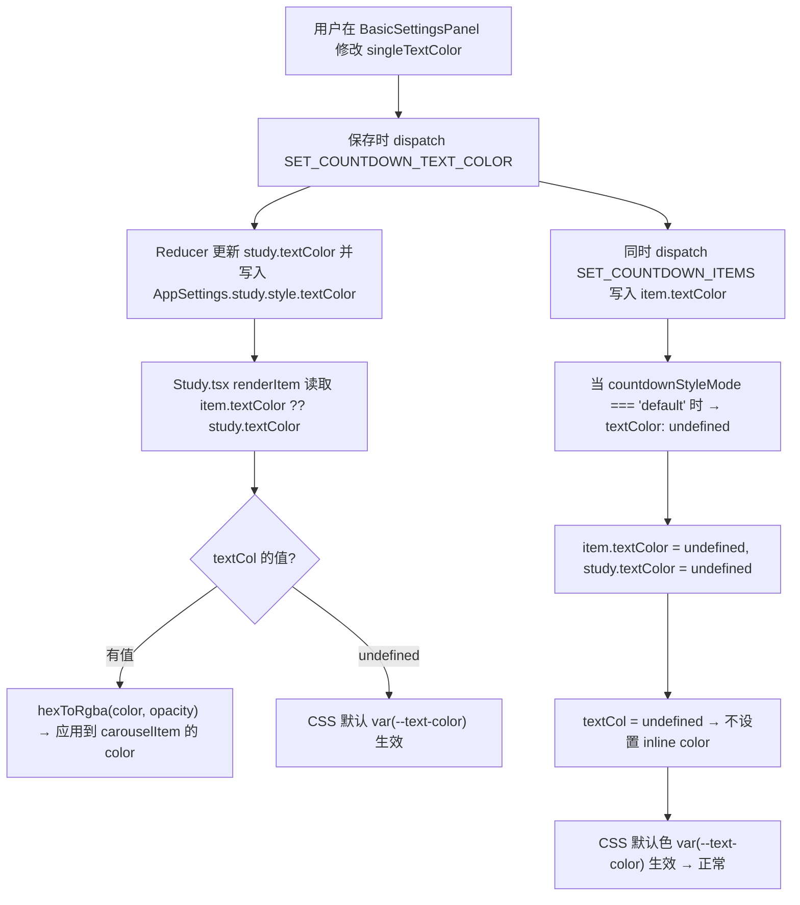

# 沉浸式时钟 — 预先检查（预检）系统 深度分析报告

> **编写日期**：2026-05-21  
> **分析范围**：日志系统、配置管理、状态管理、事件总线、组件数据流、历史 Bug 复盘  
> **目标**：设计一套"预检"系统，在问题发生前/发生时自动收集关键诊断信息，使 AI 能够一针见血地定位根因

---

## 目录

1. [核心发现摘要](#1-核心发现摘要)
2. [当前诊断系统现状](#2-当前诊断系统现状)
3. [历史 Bug 复盘与根因模式](#3-历史-bug-复盘与根因模式)
4. [架构级诊断盲区分析](#4-架构级诊断盲区分析)
5. [预检系统设计方案](#5-预检系统设计方案)
6. [优先级排序与实施路线](#6-优先级排序与实施路线)
7. [附录：关键文件索引](#7-附录关键文件索引)

---

## 1. 核心发现摘要

> [!CAUTION]
> 当前项目的诊断能力存在**三大结构性缺陷**，导致许多 Bug 从"已知症状"到"定位根因"需要大量猜测：

| 缺陷 | 具体表现 | 影响 |
|------|---------|------|
| **双源状态漂移** | `AppContext`（内存）与 `AppSettings`（localStorage）存储重叠数据，各自独立更新 | 保存成功但 UI 不生效，或重启后状态丢失 |
| **保存管道黑盒** | 设置面板一次保存 dispatch 10+ actions，每个都执行读→改→写，无日志无 diff | 无法知道哪一步失败，哪个值被覆盖 |
| **事件传播不可追踪** | `settingsSaved` 等事件无 payload、无 traceId，组件静默消费 | 无法确认哪个组件收到了事件、是否正确响应 |

---

## 2. 当前诊断系统现状

### 2.1 Logger（[logger.ts](file:///c:/Users/Changhong/Documents/Code/Immersive-clock-main/src/utils/logger.ts)）

当前日志系统是一个 **console 薄封装**，具备基本的环境感知能力：

```
┌────────────────────────────────────────────────────────┐
│  Logger                                                │
│  debug/info → 仅 DEV 环境输出到 console                │
│  warn/error → 所有环境输出 + 推送到 ErrorCenter         │
└────────────────────────────────────────────────────────┘
```

**能力评估：**

| 能力项 | 状态 | 说明 |
|--------|------|------|
| 环境感知 | ✅ | dev/prod 区分输出级别 |
| ErrorCenter 集成 | ✅ | `warn`/`error` 自动推送 |
| 日志持久化 | ❌ | 仅 console 输出，刷新即丢失 |
| 结构化元数据 | ❌ | 无组件名、模块名、traceId |
| 运行时级别控制 | ❌ | 无法在 prod 动态开启 debug |
| 日志分类/标签 | ❌ | 无法按子系统过滤 |
| 性能计时 | ❌ | 无 timing/duration 支持 |

### 2.2 ErrorCenter（[errorCenter.ts](file:///c:/Users/Changhong/Documents/Code/Immersive-clock-main/src/utils/errorCenter.ts)）

ErrorCenter 是一套独立的错误记录中枢，支持内存和持久化两种模式：

**架构：**

```
logger.warn/error → pushErrorCenterRecord()
                          │
                          ├── 去重合并（5秒窗口内相同签名合并计数）
                          ├── 内存缓冲区（最多 200 条）
                          ├── 可选 localStorage 持久化
                          └── pub/sub 通知订阅者
```

**全局捕获（[initErrorCenterGlobalCapture](file:///c:/Users/Changhong/Documents/Code/Immersive-clock-main/src/utils/errorCenter.ts#L245-L333)）：**
- `window.onerror` — 未捕获异常
- `unhandledrejection` — 未处理的 Promise 拒绝
- `messagePopup:open` — 弹窗错误
- `weatherRefreshDone` / `weatherLocationRefreshDone` — 天气获取失败

> [!WARNING]
> **ErrorCenter 默认为 `"off"` 模式**，用户必须在设置面板手动开启。这意味着：
> - 问题首次发生时，ErrorCenter 通常处于关闭状态
> - 开启后无法追溯之前发生的错误
> - `debug`/`info` 级别的日志永远不会进入 ErrorCenter

### 2.3 Settings Events（[settingsEvents.ts](file:///c:/Users/Changhong/Documents/Code/Immersive-clock-main/src/utils/settingsEvents.ts)）

已建立的事件总线框架，但使用不一致：

| 事件来源 | 是否使用统一 API | 说明 |
|---------|---------------|------|
| `settingsSaved` | ✅ `broadcastSettingsEvent()` | 由 SettingsPanel 广播 |
| `study-background-updated` | ❌ 裸写 `dispatchEvent` | BasicSettingsPanel 手动触发 |
| `messagePopup:open/close` | ❌ 裸写 `dispatchEvent` | 多处直接使用 |
| `timeSync:syncNow` | ❌ 裸写 `dispatchEvent` | SettingsPanel 手动触发 |
| `noise-samples-updated` | ❌ 裸写 `dispatchEvent` | noiseDataService 触发 |

### 2.4 SettingsSaveResult（[appSettings.ts:362](file:///c:/Users/Changhong/Documents/Code/Immersive-clock-main/src/utils/appSettings.ts#L362-L366)）

`updateAppSettings()` 返回结构化的保存结果 `{ success, error?, quotaExceeded? }`，但：

> [!IMPORTANT]
> **Reducer 中的所有 `updateAppSettings()` 调用都忽略了返回值**（[AppContext.tsx:330-635](file:///c:/Users/Changhong/Documents/Code/Immersive-clock-main/src/contexts/AppContext.tsx#L330-L635)）。  
> 这意味着：当 localStorage 写入失败（如配额超限），内存状态已更新但持久化失败——**用户看到了新值，刷新后回到旧值**。

---

## 3. 历史 Bug 复盘与根因模式

### 3.1 Bug A：倒计时文字颜色保存后部分消失

**症状**：用户在设置面板修改倒计时文本颜色并保存后，倒计时非数字部分的文字（如"距离""仅""天"）消失，数字部分正常显示。

**根因链条还原：**



**实际问题出在**：`countdownStyleMode` 判断、颜色值传播路径、和 CSS 变量级联之间的交互。存在多条可能的失败路径，但由于**没有任何日志记录保存前后的值**，需要反复猜测。

**如果有预检系统**，AI 可以看到：
```
[PreCheck] SettingsSave 
  ├─ textColor: "" → "#FF6B6B" (SET_COUNTDOWN_TEXT_COLOR)
  ├─ countdownStyleMode: "custom"
  ├─ countdownItems[0].textColor: "#FF6B6B"
  ├─ AppSettings.study.style.textColor: "#FF6B6B" ✓
  └─ Study.renderItem → textCol: "rgba(255,107,107,1)" ✓
     OR
  ├─ textColor: "#FF6B6B" → undefined (SET_COUNTDOWN_TEXT_COLOR, mode="default")
  ├─ countdownItems[0].textColor: undefined
  └─ Study.renderItem → textCol: undefined → CSS fallback ✓
```

### 3.2 Bug B：设置保存后页面刷新丢失

**症状**：字体、数字颜色等设置保存后刷新页面，所有设置重置为默认。

**根因**：背景图片以 base64 存入 `AppSettings`（localStorage），导致 `localStorage.setItem()` 超出 5-10MB 配额限制。`QuotaExceededError` 使整个 `updateAppSettings()` 失败，但由于 Reducer 中未检查返回值，内存状态已更新、界面显示正常，只是实际上没有持久化。

**修复措施**（已实施）：
- 图片迁移到 IndexedDB（[studyBackgroundStorage.ts](file:///c:/Users/Changhong/Documents/Code/Immersive-clock-main/src/utils/studyBackgroundStorage.ts)）
- `SettingsSaveResult` 增加 `quotaExceeded` 标志
- `useSettingsToast` 提供用户可见的错误反馈

**未修复的隐患**：Reducer 中 35+ 处 `updateAppSettings()` 调用仍然忽略返回值。

### 3.3 根因模式总结

| 模式代号 | 描述 | 出现频率 | 影响面 |
|---------|------|---------|--------|
| **S-DRIFT** | 内存状态与持久化状态不一致 | 高 | 所有设置项 |
| **C-CASCADE** | 颜色/样式的多层级联（item → global → CSS var → CSS default）导致某一层丢失时显示异常 | 高 | 倒计时颜色、字体 |
| **E-SILENT** | 事件触发但无法确认接收方是否正确处理 | 中 | 设置保存后的刷新 |
| **P-GATE** | `countdownStyleMode` 等门控逻辑在保存时静默传递 `undefined` | 中 | 颜色被意外清除 |
| **Q-QUOTA** | localStorage 写入失败但不可见 | 低（已部分修复） | 所有设置丢失 |

---

## 4. 架构级诊断盲区分析

### 4.1 双源状态架构

```
┌─────────────────────────────────────────────────────────────────┐
│                    数据同一性问题                                 │
│                                                                  │
│  AppContext (useReducer)          AppSettings (localStorage)     │
│  ┌──────────────────────┐        ┌──────────────────────────┐   │
│  │ study.textColor      │◄──┐    │ study.style.textColor    │   │
│  │ study.digitColor     │   │    │ study.style.digitColor   │   │
│  │ study.countdownItems │   │    │ study.countdownItems     │   │
│  │ study.digitOpacity   │   ├──► │ study.style.digitOpacity │   │
│  │ study.textOpacity    │   │    │ study.style.textOpacity  │   │
│  │ ...                  │   │    │ ...                      │   │
│  └──────────────────────┘   │    └──────────────────────────┘   │
│                             │                                    │
│              Reducer 每次 dispatch 都同步写入                      │
│              但 SettingsSaveResult 从不检查                        │
│                                                                  │
│  字段名不一致：                                                    │
│  AppContext:   study.textColor                                    │
│  AppSettings:  study.style.textColor                              │
│  CountdownItem: item.textColor                                    │
│  三个地方存储"文字颜色"，命名和结构各异                               │
└─────────────────────────────────────────────────────────────────┘
```

**字段映射表（Study 颜色相关）：**

| AppContext (StudyState) | AppSettings | CountdownItem | 读取方 |
|------------------------|-------------|---------------|--------|
| `study.textColor` | `study.style.textColor` | `item.textColor` | Study.tsx `renderItem()` |
| `study.textOpacity` | `study.style.textOpacity` | `item.textOpacity` | Study.tsx `renderItem()` |
| `study.digitColor` | `study.style.digitColor` | `item.digitColor` | Study.tsx `renderItem()` |
| `study.digitOpacity` | `study.style.digitOpacity` | `item.digitOpacity` | Study.tsx `renderItem()` |
| `study.timeColor` | `study.style.timeColor` | — | Study.tsx 内联样式 |
| `study.dateColor` | `study.style.dateColor` | — | Study.tsx 内联样式 |

> [!IMPORTANT]
> `renderItem()` 中的级联逻辑 `item.textColor ?? study.textColor` 意味着：
> - 如果 item 级别有颜色 → 使用 item 级别
> - 否则使用全局 `study.textColor`
> - 如果都为 `undefined` → `textCol = undefined` → 不设置 inline style → CSS 默认色
> 
> 这三层任何一层出现意外的 `undefined`/空字符串/`null`，都会产生不同的显示结果。

### 4.2 设置保存管道（以倒计时颜色为例）

[BasicSettingsPanel 保存逻辑](file:///c:/Users/Changhong/Documents/Code/Immersive-clock-main/src/components/SettingsPanel/sections/BasicSettingsPanel.tsx#L425-L653) 在一次保存中执行的 dispatch 序列：

```
用户点击"保存"
  ├─ dispatch SET_COUNTDOWN_TYPE          → Reducer 写 AppSettings
  ├─ dispatch SET_CUSTOM_COUNTDOWN        → Reducer 写 AppSettings
  ├─ dispatch SET_STUDY_DISPLAY           → Reducer 写 AppSettings
  ├─ dispatch SET_COUNTDOWN_DIGIT_COLOR   → Reducer 写 AppSettings  ← 颜色 ①
  ├─ dispatch SET_COUNTDOWN_DIGIT_OPACITY → Reducer 写 AppSettings
  ├─ dispatch SET_COUNTDOWN_TEXT_COLOR    → Reducer 写 AppSettings  ← 颜色 ②
  ├─ dispatch SET_COUNTDOWN_TEXT_OPACITY  → Reducer 写 AppSettings
  ├─ dispatch SET_STUDY_TIME_COLOR        → Reducer 写 AppSettings
  ├─ dispatch SET_STUDY_DATE_COLOR        → Reducer 写 AppSettings
  ├─ dispatch SET_STUDY_CARD_STYLE        → Reducer 写 AppSettings
  ├─ saveStudyBackground()                → 直接写 AppSettings
  ├─ dispatch SET_COUNTDOWN_ITEMS         → Reducer 写 AppSettings  ← 含 per-item 颜色
  ├─ updateStudySettings(countdownMode)   → 直接写 AppSettings
  ├─ dispatch SET_STUDY_NUMERIC_FONT      → Reducer 写 AppSettings
  ├─ dispatch SET_STUDY_TEXT_FONT         → Reducer 写 AppSettings
  ├─ updateGeneralSettings(startup)       → 直接写 AppSettings
  ├─ updatePerformanceSettings(...)       → 直接写 AppSettings
  └─ updateTimeSyncSettings(...)          → 直接写 AppSettings
      │
      └─ 共计 ~17 次 getAppSettings() + JSON.parse + merge + JSON.stringify + setItem
         每次都是完整的 读-改-写 循环
```

> [!WARNING]
> **每次 dispatch 都触发一次完整的 localStorage 读-写循环**。这意味着：
> 1. 如果中间某次写入失败（如配额），后续写入会基于过时的数据
> 2. 多次写入的"合并窗口"只有 JSON.stringify/parse 的执行时间（微秒级），理论上不会竞争，但代码不保证原子性
> 3. **无法知道是哪一步失败的**——没有任何 before/after 的 diff 日志

### 4.3 事件传播盲区

```
BasicSettingsPanel 保存后
  └─ SettingsPanel.handleSaveAll()
       └─ broadcastSettingsEvent("settingsSaved", { targetYear })
            │
            ├─► BasicSettingsPanel 自身监听 → 刷新 timeSyncStatus ✓
            ├─► timeSync.ts 监听 → 刷新校时配置 ✓  
            ├─► StudyStatus 监听 → 刷新课表 ✓
            ├─► Weather 监听 → 刷新天气 ✓
            └─► Study.tsx → ❌ 不监听此事件！
                 Study 依赖 AppContext 变化触发 re-render
                 如果 Context 没变（例如写入失败），UI 不会更新
```

**问题**：Study.tsx 不直接监听 `settingsSaved`，它完全依赖 AppContext 的 state 变化。如果 Reducer 更新了 state（dispatch 总是同步成功的），Study 会 re-render；但如果 localStorage 写入失败，下次页面加载时会回退。

---

## 5. 预检系统设计方案

### 5.1 设计原则

```
┌───────────────────────────────────────────────────────────────┐
│  预检系统设计原则                                               │
│                                                                │
│  1. 零侵入：不改变现有数据流，只在关键节点"旁听"并记录           │
│  2. 开发态优先：主要在开发环境启用完整日志，生产环境仅保留核心     │
│  3. 快照为王：记录"某一时刻的完整状态"而非"流水式日志"            │
│  4. AI 可消费：输出结构化 JSON，便于 AI 解析和推理                │
│  5. 分层可选：从核心到扩展分层启用，避免性能影响                  │
└───────────────────────────────────────────────────────────────┘
```

### 5.2 四层架构

```
┌────────────────────────────────────────────────────────────────┐
│                        预检系统架构                              │
│                                                                 │
│  Layer 4: 自动化巡检层 (Watchdog)                                │
│  ┌──────────────────────────────────────────────────────────┐   │
│  │ 定期运行完整性检查，输出健康报告                            │   │
│  │ - Settings 完整性校验                                       │   │
│  │ - localStorage 容量监测                                     │   │
│  │ - Context ↔ Settings 一致性比对                              │   │
│  └──────────────────────────────────────────────────────────┘   │
│                                                                 │
│  Layer 3: 数据流追踪层 (Tracer)                                  │
│  ┌──────────────────────────────────────────────────────────┐   │
│  │ 追踪设置保存的完整生命周期                                   │   │
│  │ - Reducer Action 拦截 + before/after diff                    │   │
│  │ - Settings 写入拦截 + SettingsSaveResult 监控                │   │
│  │ - Event 广播/接收追踪                                        │   │
│  └──────────────────────────────────────────────────────────┘   │
│                                                                 │
│  Layer 2: 组件快照层 (Snapshot)                                   │
│  ┌──────────────────────────────────────────────────────────┐   │
│  │ 在组件关键生命周期自动记录状态快照                            │   │
│  │ - 组件挂载时的 props + context 快照                          │   │
│  │ - 渲染时的计算值快照（颜色级联结果等）                        │   │
│  │ - 设置面板打开/关闭时的草稿 ↔ 持久化对比                     │   │
│  └──────────────────────────────────────────────────────────┘   │
│                                                                 │
│  Layer 1: 核心基础层 (Foundation)                                │
│  ┌──────────────────────────────────────────────────────────┐   │
│  │ 增强 Logger + ErrorCenter 的基础能力                         │   │
│  │ - 结构化日志（模块标签 + 上下文元数据）                       │   │
│  │ - 环形日志缓冲区（保留最近 N 条，含 debug/info）              │   │
│  │ - ErrorCenter 默认启用 memory 模式                           │   │
│  │ - 可导出的诊断报告生成                                       │   │
│  └──────────────────────────────────────────────────────────┘   │
└────────────────────────────────────────────────────────────────┘
```

### 5.3 Layer 1：核心基础层 — 增强 Logger

#### 5.3.1 结构化日志 API

```typescript
// src/utils/precheck/precheckLogger.ts

interface PrecheckLogEntry {
  ts: number;            // 时间戳
  level: "debug" | "info" | "warn" | "error";
  module: string;        // 模块标识，如 "Settings.Save", "Study.Render", "Reducer"
  action?: string;       // 动作标识，如 "SET_COUNTDOWN_TEXT_COLOR"
  message: string;       // 人类可读消息
  data?: Record<string, unknown>;  // 结构化上下文
  traceId?: string;      // 关联 ID（一次保存操作共享）
}

/**
 * 预检日志器（带模块标签的结构化日志）
 * 示例：
 *   const log = createPrecheckLogger("Study.Render");
 *   log.info("renderItem 颜色级联", { itemTextColor, studyTextColor, finalColor });
 */
export function createPrecheckLogger(module: string) {
  return {
    debug(message: string, data?: Record<string, unknown>) { ... },
    info(message: string, data?: Record<string, unknown>) { ... },
    warn(message: string, data?: Record<string, unknown>) { ... },
    error(message: string, data?: Record<string, unknown>) { ... },
  };
}
```

#### 5.3.2 环形日志缓冲区

```typescript
// src/utils/precheck/logRingBuffer.ts

const MAX_ENTRIES = 500;  // 保留最近 500 条
const buffer: PrecheckLogEntry[] = [];

/** 写入一条日志（所有级别都保留，包括 debug/info） */
export function pushLog(entry: PrecheckLogEntry): void { ... }

/** 获取缓冲区快照（用于导出或 AI 诊断） */
export function getLogSnapshot(): ReadonlyArray<PrecheckLogEntry> { ... }

/** 按模块/级别筛选 */
export function queryLogs(filter: {
  module?: string;
  level?: PrecheckLogEntry["level"];
  since?: number;
  traceId?: string;
}): PrecheckLogEntry[] { ... }

/** 导出为 JSON 字符串 */
export function exportLogsJson(): string { ... }
```

#### 5.3.3 ErrorCenter 默认启用

**建议改动**：将 ErrorCenter 默认模式从 `"off"` 改为 `"memory"`，确保始终收集 warn/error。

### 5.4 Layer 2：组件快照层

#### 5.4.1 组件挂载快照 Hook

```typescript
// src/hooks/usePrecheckSnapshot.ts

/**
 * 在组件挂载时记录初始状态快照
 * 示例：
 *   usePrecheckSnapshot("Study", {
 *     textColor: study.textColor,
 *     digitColor: study.digitColor,
 *     countdownItems: study.countdownItems,
 *     countdownMode: countdownMode,
 *   });
 */
export function usePrecheckSnapshot(
  componentName: string,
  stateSnapshot: Record<string, unknown>
): void;
```

#### 5.4.2 重点组件的快照点

| 组件 | 快照时机 | 记录内容 |
|------|---------|---------|
| **Study** | 挂载 | `study.*` 全量（颜色、字体、显示开关、countdownItems） |
| **Study.renderItem** | 每次渲染 | `item.textColor`, `study.textColor`, `finalTextCol`, `item.digitColor`, `study.digitColor`, `finalDigitCol` |
| **BasicSettingsPanel** | 打开 | 从 `useEffect` 中的初始化逻辑记录：`countdownMode`, `countdownStyleMode`, `singleTextColor`, `digitColor` 等草稿初值 |
| **BasicSettingsPanel** | 保存 | 全部 dispatch 的 payload 快照 |
| **ClockPage** | 模式切换 | `mode`, `isHudVisible`, `backgroundSettings` |

#### 5.4.3 设置面板 Diff

```typescript
// 保存前后自动 diff
const log = createPrecheckLogger("Settings.Save");

// 保存前快照
const before = getAppSettings();

// 执行所有 dispatch...

// 保存后快照
const after = getAppSettings();

// 计算 diff
const diff = deepDiff(before, after);
log.info("设置保存完成", {
  traceId: saveTraceId,
  changedFields: diff.map(d => d.path.join(".")),
  diff,
  saveResults: allSaveResults,
});
```

### 5.5 Layer 3：数据流追踪层

#### 5.5.1 Reducer 中间件

```typescript
// src/utils/precheck/reducerMiddleware.ts

/**
 * 包装 appReducer，在每次 dispatch 前后记录状态变化
 * 
 * 注意：不改变 Reducer 的纯函数语义，只是在外层"旁听"
 */
export function withPrecheckMiddleware(
  reducer: typeof appReducer
): typeof appReducer {
  return (state, action) => {
    const log = createPrecheckLogger("Reducer");
    const traceId = generateTraceId();
    
    // 记录 action
    log.debug(`dispatch ${action.type}`, {
      traceId,
      payload: "payload" in action ? action.payload : undefined,
    });
    
    // 执行 reducer
    const nextState = reducer(state, action);
    
    // 记录变化的字段
    const changedPaths = getChangedPaths(state, nextState);
    if (changedPaths.length > 0) {
      log.debug(`状态变化`, {
        traceId,
        action: action.type,
        changed: changedPaths,
      });
    }
    
    return nextState;
  };
}
```

#### 5.5.2 Settings 写入监控

```typescript
// 增强 updateAppSettings，自动记录 SettingsSaveResult

const originalUpdate = updateAppSettings;

export function monitoredUpdateAppSettings(...args) {
  const result = originalUpdate(...args);
  
  if (!result.success) {
    precheckLog.error("Settings 写入失败", {
      error: result.error,
      quotaExceeded: result.quotaExceeded,
      caller: new Error().stack,  // 调用栈
    });
  }
  
  return result;
}
```

#### 5.5.3 事件追踪器

```typescript
// src/utils/precheck/eventTracer.ts

/**
 * 自动追踪所有设置相关事件的广播和接收
 * 
 * 使用方法：在 App 初始化时调用 initEventTracer()
 */
export function initEventTracer(): void {
  // 拦截 broadcastSettingsEvent
  const originalBroadcast = broadcastSettingsEvent;
  broadcastSettingsEvent = (name, detail) => {
    precheckLog.info(`Event 广播: ${name}`, { detail });
    originalBroadcast(name, detail);
  };
  
  // 监听所有已知事件
  for (const eventName of Object.values(SETTINGS_EVENTS)) {
    window.addEventListener(eventName, (e) => {
      precheckLog.info(`Event 接收: ${eventName}`, {
        detail: (e as CustomEvent).detail,
        listeners: "unable to enumerate",  // 浏览器限制
      });
    });
  }
}
```

### 5.6 Layer 4：自动化巡检层

#### 5.6.1 Settings 完整性校验

```typescript
// src/utils/precheck/settingsIntegrity.ts

interface IntegrityReport {
  timestamp: number;
  status: "healthy" | "degraded" | "corrupted";
  checks: IntegrityCheck[];
}

interface IntegrityCheck {
  name: string;
  status: "pass" | "warn" | "fail";
  message: string;
  details?: unknown;
}

export function runSettingsIntegrityCheck(): IntegrityReport {
  const checks: IntegrityCheck[] = [];
  
  // 1. AppSettings 可读性
  checks.push(checkSettingsReadable());
  
  // 2. 版本号存在且有效
  checks.push(checkSettingsVersion());
  
  // 3. 所有必要字段存在且类型正确
  checks.push(checkRequiredFields());
  
  // 4. 颜色值格式有效（hex 格式校验）
  checks.push(checkColorValues());
  
  // 5. localStorage 容量检查
  checks.push(checkStorageQuota());
  
  // 6. countdownItems 结构校验
  checks.push(checkCountdownItems());
  
  // 7. Context ↔ Settings 一致性
  checks.push(checkContextSettingsConsistency());
  
  return {
    timestamp: Date.now(),
    status: deriveOverallStatus(checks),
    checks,
  };
}
```

#### 5.6.2 Context ↔ Settings 一致性检查

```typescript
function checkContextSettingsConsistency(): IntegrityCheck {
  const contextState = getAppContextSnapshot(); // 需要导出 state 快照能力
  const settings = getAppSettings();
  
  const mismatches: string[] = [];
  
  // 检查颜色字段一致性
  if (contextState.study.textColor !== settings.study.style.textColor) {
    mismatches.push(
      `study.textColor: Context=${contextState.study.textColor} vs Settings=${settings.study.style.textColor}`
    );
  }
  // ... 其他字段
  
  return {
    name: "Context ↔ Settings 一致性",
    status: mismatches.length === 0 ? "pass" : "warn",
    message: mismatches.length === 0 
      ? "内存状态与持久化状态一致" 
      : `发现 ${mismatches.length} 处不一致`,
    details: mismatches,
  };
}
```

#### 5.6.3 存储容量监测

```typescript
async function checkStorageQuota(): Promise<IntegrityCheck> {
  // 1. localStorage 使用量估算
  let totalSize = 0;
  for (let i = 0; i < localStorage.length; i++) {
    const key = localStorage.key(i);
    if (key) {
      totalSize += key.length + (localStorage.getItem(key)?.length || 0);
    }
  }
  const totalSizeMB = (totalSize * 2) / (1024 * 1024); // UTF-16 每字符 2 字节
  
  // 2. navigator.storage.estimate()
  let quotaInfo = null;
  if (navigator.storage?.estimate) {
    quotaInfo = await navigator.storage.estimate();
  }
  
  return {
    name: "存储容量",
    status: totalSizeMB > 4 ? "warn" : "pass",
    message: `localStorage: ${totalSizeMB.toFixed(2)} MB`,
    details: { localStorageMB: totalSizeMB, quota: quotaInfo },
  };
}
```

### 5.7 诊断报告生成器

```typescript
// src/utils/precheck/diagnosticReport.ts

/**
 * 生成完整的诊断报告，供 AI 消费
 * 
 * 可通过 console 命令 `window.__precheck.generateReport()` 调用
 * 或通过设置面板的"导出诊断信息"按钮触发
 */
export async function generateDiagnosticReport(): Promise<DiagnosticReport> {
  return {
    generatedAt: new Date().toISOString(),
    appVersion: import.meta.env.VITE_APP_VERSION,
    
    // Layer 1: 最近日志
    recentLogs: getLogSnapshot(),
    errorCenterRecords: getErrorCenterRecords(),
    
    // Layer 2: 当前状态快照
    appSettings: getAppSettings(),
    appContextState: getAppContextSnapshot(),
    
    // Layer 3: 数据流追踪
    recentActionLog: getRecentActions(),
    recentEventLog: getRecentEvents(),
    
    // Layer 4: 巡检报告
    integrityReport: await runSettingsIntegrityCheck(),
    
    // 环境信息
    environment: {
      userAgent: navigator.userAgent,
      isElectron: isElectronEnv(),
      localStorage: {
        keyCount: localStorage.length,
        estimatedSizeMB: estimateLocalStorageSize(),
      },
    },
  };
}
```

---

## 6. 优先级排序与实施路线

### 6.1 分期实施计划

```
Phase 0 (立即可做，无需新文件)          ← 已有代码的小改动
├─ ErrorCenter 默认模式改为 "memory"
├─ Reducer 中 updateAppSettings() 返回值检查 + 失败时 logger.error
└─ BasicSettingsPanel 保存时记录 before/after diff

Phase 1 (核心基础，1-2 天)              ← 新建预检基础设施
├─ 新建 src/utils/precheck/ 目录
├─ 实现 PrecheckLogger（带模块标签）
├─ 实现 LogRingBuffer（环形缓冲区）
├─ 实现 generateDiagnosticReport() 基础版
└─ 在设置面板"关于"页面增加"导出诊断信息"按钮

Phase 2 (组件快照 + 追踪，2-3 天)       ← 在关键组件埋点
├─ 实现 usePrecheckSnapshot Hook
├─ Study.tsx renderItem() 颜色级联日志
├─ BasicSettingsPanel 保存流程追踪
├─ Reducer 中间件（action + state diff）
└─ Event 追踪器

Phase 3 (自动化巡检，1-2 天)            ← 自动发现问题
├─ Settings 完整性校验
├─ Context ↔ Settings 一致性检查
├─ 存储容量监测
└─ 定期巡检 + 异常自动上报到 ErrorCenter
```

### 6.2 优先级矩阵

| 功能 | 优先级 | 实施难度 | 预期收益 | Phase |
|------|--------|---------|---------|-------|
| Reducer 写入失败检查 | **P0** | 低 | 立即消除"静默丢数据"问题 | 0 |
| ErrorCenter 默认启用 | **P0** | 低 | 始终有错误记录可查 | 0 |
| 设置保存 before/after diff | **P0** | 中 | 一眼看出哪些值变了 | 0 |
| PrecheckLogger + RingBuffer | **P1** | 中 | 为所有后续功能提供基础 | 1 |
| 诊断报告导出 | **P1** | 中 | 用户可一键导出给 AI | 1 |
| 组件挂载快照 | **P1** | 低 | 快速确认组件初始状态 | 2 |
| renderItem 颜色级联日志 | **P1** | 低 | 直接解决颜色类 Bug | 2 |
| Reducer 中间件 | **P2** | 中 | 完整的 action 追踪 | 2 |
| Event 追踪器 | **P2** | 中 | 事件传播可视化 | 2 |
| Settings 完整性校验 | **P2** | 中 | 启动时自检 | 3 |
| Context ↔ Settings 一致性 | **P2** | 高 | 发现状态漂移 | 3 |
| 存储容量监测 | **P3** | 低 | 预防配额问题复发 | 3 |

### 6.3 对现有代码的影响评估

| 影响范围 | 变更类型 | 详情 |
|---------|---------|------|
| [logger.ts](file:///c:/Users/Changhong/Documents/Code/Immersive-clock-main/src/utils/logger.ts) | 增强 | 可选地接入 RingBuffer，保持向后兼容 |
| [errorCenter.ts](file:///c:/Users/Changhong/Documents/Code/Immersive-clock-main/src/utils/errorCenter.ts) | 微调 | 默认模式改为 `"memory"` |
| [AppContext.tsx](file:///c:/Users/Changhong/Documents/Code/Immersive-clock-main/src/contexts/AppContext.tsx) | 微调 | Reducer 中检查 `SettingsSaveResult`；可选加入中间件包装 |
| [BasicSettingsPanel.tsx](file:///c:/Users/Changhong/Documents/Code/Immersive-clock-main/src/components/SettingsPanel/sections/BasicSettingsPanel.tsx) | 增强 | 保存前后增加 diff 日志 |
| [Study.tsx](file:///c:/Users/Changhong/Documents/Code/Immersive-clock-main/src/components/Study/Study.tsx) | 增强 | `renderItem` 增加颜色级联日志 |
| `src/utils/precheck/` | **新增** | 整个预检子系统 |
| 设置面板"关于"页 | 增强 | 增加"导出诊断信息"按钮 |

---

## 7. 附录：关键文件索引

### 核心系统文件

| 文件 | 职责 | 行数 |
|------|------|------|
| [logger.ts](file:///c:/Users/Changhong/Documents/Code/Immersive-clock-main/src/utils/logger.ts) | 日志工具 | 80 |
| [errorCenter.ts](file:///c:/Users/Changhong/Documents/Code/Immersive-clock-main/src/utils/errorCenter.ts) | 错误记录中枢 | 334 |
| [appSettings.ts](file:///c:/Users/Changhong/Documents/Code/Immersive-clock-main/src/utils/appSettings.ts) | 配置管理 | 582 |
| [storageInitializer.ts](file:///c:/Users/Changhong/Documents/Code/Immersive-clock-main/src/utils/storageInitializer.ts) | 存储初始化 & 迁移 | 209 |
| [settingsEvents.ts](file:///c:/Users/Changhong/Documents/Code/Immersive-clock-main/src/utils/settingsEvents.ts) | 事件总线 | 59 |
| [AppContext.tsx](file:///c:/Users/Changhong/Documents/Code/Immersive-clock-main/src/contexts/AppContext.tsx) | 全局状态管理 | 894 |
| [index.ts (types)](file:///c:/Users/Changhong/Documents/Code/Immersive-clock-main/src/types/index.ts) | 类型定义 | 379 |

### 组件文件

| 文件 | 职责 | 行数 |
|------|------|------|
| [Study.tsx](file:///c:/Users/Changhong/Documents/Code/Immersive-clock-main/src/components/Study/Study.tsx) | 自习模式（含倒计时轮播） | 565 |
| [Countdown.tsx](file:///c:/Users/Changhong/Documents/Code/Immersive-clock-main/src/components/Countdown/Countdown.tsx) | 倒计时模式（计时器） | 188 |
| [BasicSettingsPanel.tsx](file:///c:/Users/Changhong/Documents/Code/Immersive-clock-main/src/components/SettingsPanel/sections/BasicSettingsPanel.tsx) | 基础设置面板 | 1572 |
| [SettingsPanel.tsx](file:///c:/Users/Changhong/Documents/Code/Immersive-clock-main/src/components/SettingsPanel/SettingsPanel.tsx) | 设置面板容器 | ~201 |

### 历史对话参考

| 对话 | 主题 | 教训 |
|------|------|------|
| `07bf8f95` | 倒计时文字颜色消失 | 颜色级联 + countdownStyleMode 门控 |
| `0a2e28b9` | 设置保存后刷新丢失 | localStorage 配额 + 静默失败 |

---

> [!NOTE]
> 本报告基于对代码库的深度静态分析和历史对话记录的复盘。预检系统的具体实施方案需要根据项目的实际优先级和资源情况进行调整。建议从 **Phase 0**（零成本改进）开始，立即消除最严重的"静默失败"问题，再逐步推进后续层级。
